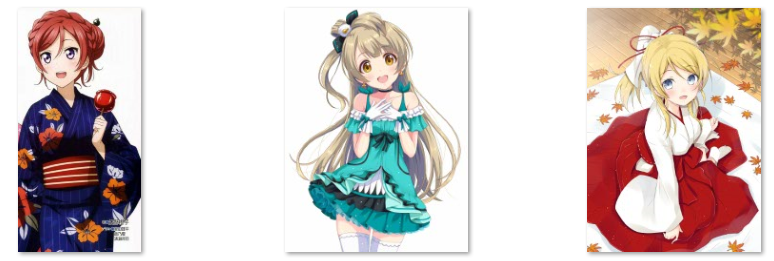
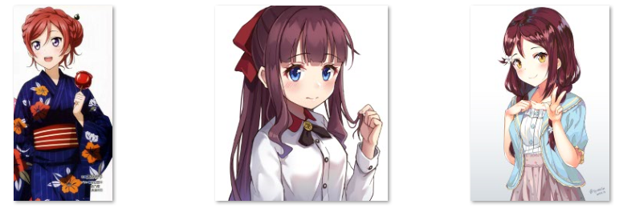
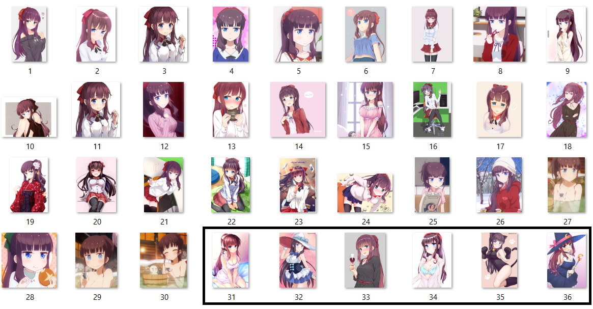

# Transfer Learning for Anime Characters

This repository is the continuation of [Flag #15 - Image Recognition for Anime Characters](http://freedomofkeima.com/blog/posts/flag-15-image-recognition-for-anime-characters).

 is created by [nagadomi/lbpcascade_animeface](https://github.com/nagadomi/lbpcascade_animeface).

Warning: This repository size is quite big (approx. 100 MB) since it includes training & test images.

## Introduction

In Flag #15, we can see that Transfer Learning works really well with 3 different anime characters: Nishikino Maki, Kotori Minami, and Ayase Eli.

In this experiment, we will try to push Transfer Learning further, by using 3 different anime characters which have hair color similarity: Nishikino Maki, Takimoto Hifumi, and Sakurauchi Riko.

Raw directory contains 36 images for each characters (JPG & PNG format). The first 30 images are used for training while the last 6 images are used for test.

## Requirements

## License

Copyright for all images are owned by their respective creators.
