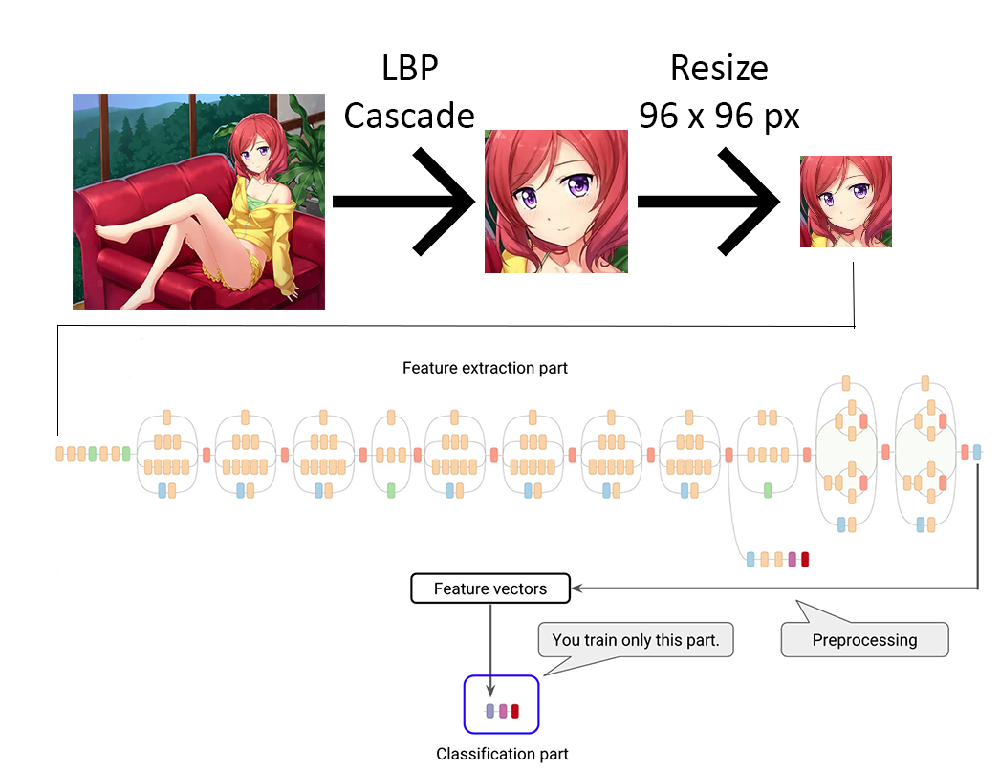
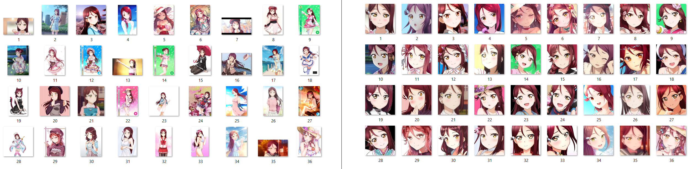

# Transfer Learning for Anime Characters

This repository is the continuation of [Flag #15 - Image Recognition for Anime Characters](http://freedomofkeima.com/blog/posts/flag-15-image-recognition-for-anime-characters).

 is created by [nagadomi/lbpcascade_animeface](https://github.com/nagadomi/lbpcascade_animeface).

Warning: This repository size is quite big (approx. 100 MB) since it includes training & test images.

## Introduction

In Flag #15, we can see that Transfer Learning works really well with 3 different anime characters: Nishikino Maki, Kotori Minami, and Ayase Eli.


In this experiment, we will try to push Transfer Learning further, by using 3 different anime characters which have hair color similarity: Nishikino Maki, Takimoto Hifumi, and Sakurauchi Riko.


This experiment has 3 main steps:
1. Utilize `lbpcascade_animeface` to recognize character face from each images
2. Resize each images to 96 x 96 pixels
3. Split images into training & test before creating the final model



`raw` directory contains 36 images for each characters (JPG & PNG format). The first 30 images are used for training while the last 6 images are used for test.


As an example, we got the following result after applying Step 1 (`cropped` directory is shown at the right side):



`lbpcascade_animeface` can detect character faces with an accuracy of around **83%**. Failed images are stored in `raw (unrecognized)` for future improvements.

Since we have 3 characters and 6 test images for each which are not part of training, `resized_for_test` contains 18 images in total. Surprisingly, **all characters** are detected properly with 0% top-1 error rate!

## Requirements

- OpenCV (https://github.com/opencv/opencv)
- TensorFlow (https://github.com/tensorflow/tensorflow)

## Steps

1. The following command is used to populate `cropped` directory.

```
$ python bulk_convert.py raw/[character_name] cropped
```

2. The following command is used to populate `resized_for_training` & `resized_for_test` directory.

```
$ python bulk_resize.py cropped/[character_name] resized
```

After running the step above, you can decide how many images will be used in `resized_for_training` and how many images will be used in `resized_for_test`.

3. Re-train the Inception model by using transfer learning:

```
$ bazel-bin/tensorflow/examples/image_retraining/retrain --image_dir ~/transfer-learning-anime/resized_for_traning/
$ bazel build tensorflow/examples/image_retraining:label_image
```

4. At this point, the model is ready to use. We can run the following command to get the classification result:

```
$ bazel-bin/tensorflow/examples/image_retraining/label_image --graph=/tmp/output_graph.pb --labels=/tmp/output_labels.txt --output_layer=final_result:0 --image=$HOME/transfer-learning-anime/resized_for_test/[character name]/[image name]
```

If everything works properly, you will get the classification result.  See [TensorFlow Documentation](https://www.tensorflow.org/tutorials/image_retraining) for more options.

## Result Analysis

Initially, we run the experiment with 2 characters: Nishikino Maki and Takimoto Hifumi.

```
INFO:tensorflow:2017-11-10 08:50:36.151387: Step 3999: Train accuracy = 100.0%
INFO:tensorflow:2017-11-10 08:50:36.151592: Step 3999: Cross entropy = 0.002191
INFO:tensorflow:2017-11-10 08:50:36.210147: Step 3999: Validation accuracy = 100.0% (N=100)
INFO:tensorflow:Final test accuracy = 92.9% (N=14)
```

The result is as the following:

|Image|Classification| OK/NG |
| --- | --- | --- |
|  | nishikino maki (score = 0.99874)<br>takimoto hifumi (score = 0.00126) | OK |
|  | nishikino maki (score = 0.75519)<br>takimoto hifumi (score = 0.24481) | OK |
|  | nishikino maki (score = 0.99513)<br>takimoto hifumi (score = 0.00487) | OK |
|  | nishikino maki (score = 0.98629)<br>takimoto hifumi (score = 0.01371) | OK |
|  | nishikino maki (score = 0.99723)<br>takimoto hifumi (score = 0.00277) | OK |
|  | nishikino maki (score = 0.99695)<br>takimoto hifumi (score = 0.00305) | OK |
|  | takimoto hifumi (score = 0.63084)<br>nishikino maki (score = 0.36916) | OK|
|  | takimoto hifumi (score = 0.99728)<br>nishikino maki (score = 0.00272) | OK |
|  | takimoto hifumi (score = 0.99972)<br>nishikino maki (score = 0.00028) | OK |
|  | takimoto hifumi (score = 0.98852)<br>nishikino maki (score = 0.01148) | OK |
|  | takimoto hifumi (score = 0.99456)<br>nishikino maki (score = 0.00544) | OK |
|  | takimoto hifumi (score = 0.96630)<br>nishikino maki (score = 0.03370) | OK |

From the result above, 10 out of 12 have threshold > 0.95, while the lowest threshold is 0.63.

At this point, I decided to add Sakurauchi Riko, which is known for its similarity to Nishikino Maki.

```
INFO:tensorflow:2017-11-10 13:13:59.270717: Step 3999: Train accuracy = 100.0%
INFO:tensorflow:2017-11-10 13:13:59.270912: Step 3999: Cross entropy = 0.005526
INFO:tensorflow:2017-11-10 13:13:59.328139: Step 3999: Validation accuracy = 100.0% (N=100)
INFO:tensorflow:Final test accuracy = 80.0% (N=15)
```

With 3 similar characters, the result is as the following:

|Image|Classification| OK/NG |
| --- | --- | --- |
|  | nishikino maki (score = 0.99352)<br>sakurauchi riko (score = 0.00612)<br>takimoto hifumi (score = 0.00036) | OK |
|  | nishikino maki (score = 0.47391)<br>sakurauchi riko (score = 0.37913)<br>takimoto hifumi (score = 0.14696) | OK |
|  | nishikino maki (score = 0.95976)<br>sakurauchi riko (score = 0.02797)<br>takimoto hifumi (score = 0.01227) | OK |
|  | nishikino maki (score = 0.88851)<br>sakurauchi riko (score = 0.07526)<br>takimoto hifumi (score = 0.03623) | OK |
|  | nishikino maki (score = 0.99025)<br>sakurauchi riko (score = 0.00766)<br>takimoto hifumi (score = 0.00209) | OK |
|  | nishikino maki (score = 0.96782)<br>sakurauchi riko (score = 0.02783)<br>takimoto hifumi (score = 0.00435) | OK |

As you can see above, the similarity between Nishikino Maki and Sakurauchi Miko starts to lower down the confidence level of the resulted model. Nevertheless, all classifications are still correct, where 4 out of 6 maintain the threshold of > 0.95.

## License

Copyright for all images are owned by their respective creators.
